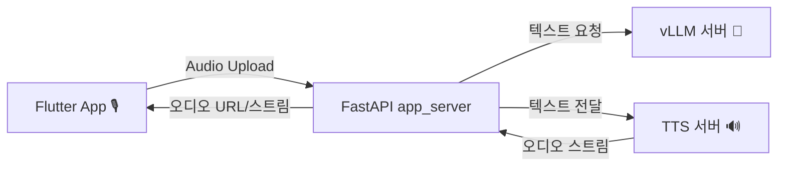

문단 시작
알겠습니다 🙂 지금까지 드린 내용을 **가독성 좋은 Markdown 문서 형식**으로 다시 정리해드릴게요.

---

# 📢 LLM + TTS 서비스 아키텍처 제안

현재 구성:

* **Flutter 앱 (클라이언트)**
* **FastAPI `app_server` (백엔드 오케스트레이터)**
* **vLLM 서버 (LLM 추론 전용)**

---

## 1. TTS는 어디서 구현해야 하나?

### ✅ 권장: **별도 `tts-server` (마이크로서비스)**

* **장점**

  * **스케일링 분리**: LLM은 GPU, TTS는 CPU 중심 → 각자 독립적으로 확장 가능
  * **캐싱/포맷 관리**: 안내 멘트 캐싱, WAV → MP3 변환 등 TTS에서 집중 관리
  * **보이스 실험 용이**: 보이스 교체·추가 시 LLM 서버에 영향 없음
  * **장애 격리**: LLM 문제 발생 시에도 TTS 안정성 유지

---

### ⚡ 단기 PoC: **`app_server`에 내장**

* FastAPI 안에서 Piper 같은 TTS를 직접 실행
* 초기 개발/테스트에 빠름
* 단, 추후 트래픽이 늘면 **분리 필요**

---

### 📱 특수 상황: **클라이언트 TTS (Flutter 내장)**

* Flutter에서 TTS 플러그인 사용 (예: `flutter_tts`)
* **프라이버시/오프라인 모드**용으로 적합
* 품질/음색은 서버 TTS보다 제한적

---

## 2. 권장 배치 구조



* **app_server**: 세션 관리, LLM 응답 수집, TTS 프록시
* **vLLM 서버**: LLM 추론 전담
* **tts-server**: Piper/OpenTTS/XTTS 등으로 음성 합성
* **Flutter**: 오디오 스트림만 재생

---

## 3. Docker Compose 예시

```yaml
version: "3.9"
services:
  app_server:
    build: ./app_server
    environment:
      - TTS_BASE_URL=http://tts-server:5500
    ports:
      - "8080:8080"

  tts-server:
    image: rhasspy/wyoming-piper:latest
    ports:
      - "5500:5500"

  vllm:
    image: vllm/vllm-openai:latest
    ports:
      - "8001:8000"
```

---

## 4. FastAPI: TTS 프록시 라우트

```python
# app_server/main.py
import os, httpx
from fastapi import FastAPI, Query
from fastapi.responses import StreamingResponse

app = FastAPI()
TTS_BASE = os.environ.get("TTS_BASE_URL", "http://localhost:5500")

@app.get("/speak")
async def speak(text: str = Query(...)):
    async with httpx.AsyncClient(timeout=None) as client:
        resp = await client.stream("GET", f"{TTS_BASE}/api/tts?text={text}")
        async def iter_audio():
            async for chunk in resp.aiter_bytes():
                yield chunk
    return StreamingResponse(iter_audio(), media_type="audio/wav")
```

---

## 5. Flutter: 서버 TTS 오디오 재생 예시

```dart
import 'package:just_audio/just_audio.dart';
import 'package:flutter/material.dart';

class TtsPlayer extends StatefulWidget {
  final String text;
  const TtsPlayer({super.key, required this.text});

  @override
  State<TtsPlayer> createState() => _TtsPlayerState();
}

class _TtsPlayerState extends State<TtsPlayer> {
  final _player = AudioPlayer();

  Future<void> _play() async {
    final url = Uri.parse(
      "https://YOUR_APP_SERVER/speak?text=${Uri.encodeComponent(widget.text)}",
    );
    await _player.setAudioSource(AudioSource.uri(url));
    await _player.play();
  }

  @override
  Widget build(BuildContext context) {
    return ElevatedButton(
      onPressed: _play,
      child: const Text("▶ 재생"),
    );
  }
}
```

---

## 6. 선택 가이드

| 상황              | 권장 방안                          |
| --------------- | ------------------------------ |
| **프로덕션/확장성 필요** | 별도 `tts-server`                |
| **PoC/테스트**     | `app_server` 내장                |
| **프라이버시/오프라인**  | Flutter 클라이언트 TTS              |
| **고품질 다국어/감정**  | 별도 `tts-server` + XTTS/OpenTTS |

---

## ✅ 정리

* **TTS는 별도 서버(`tts-server`) 분리가 권장**
* PoC는 `app_server`에 내장해도 OK
* Flutter는 오디오 스트림만 재생 → 배터리/데이터 절약
* 고도화 시 **보이스 캐시, 포맷 변환, 다국어 모델**을 `tts-server`에서 관리

---

혹시 원하시면 제가 **Piper TTS 한국어 서버 구축 + Dockerfile 예시**까지 작성해드릴까요?
